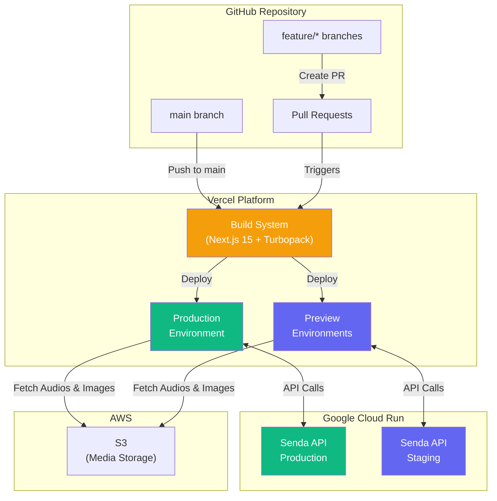
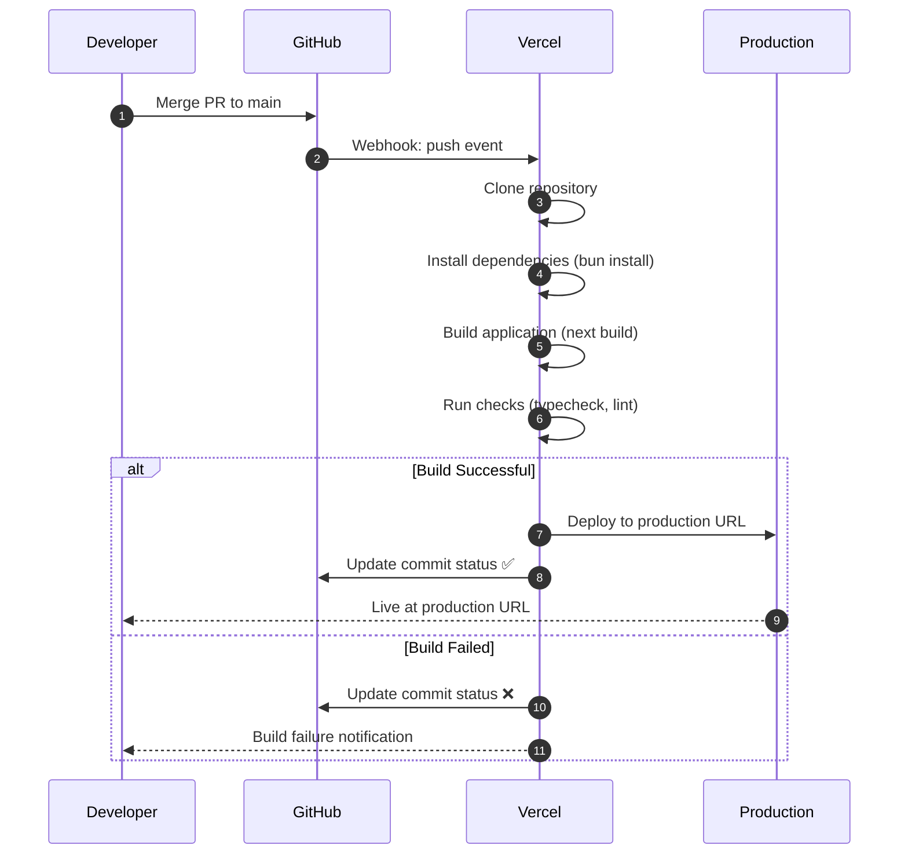
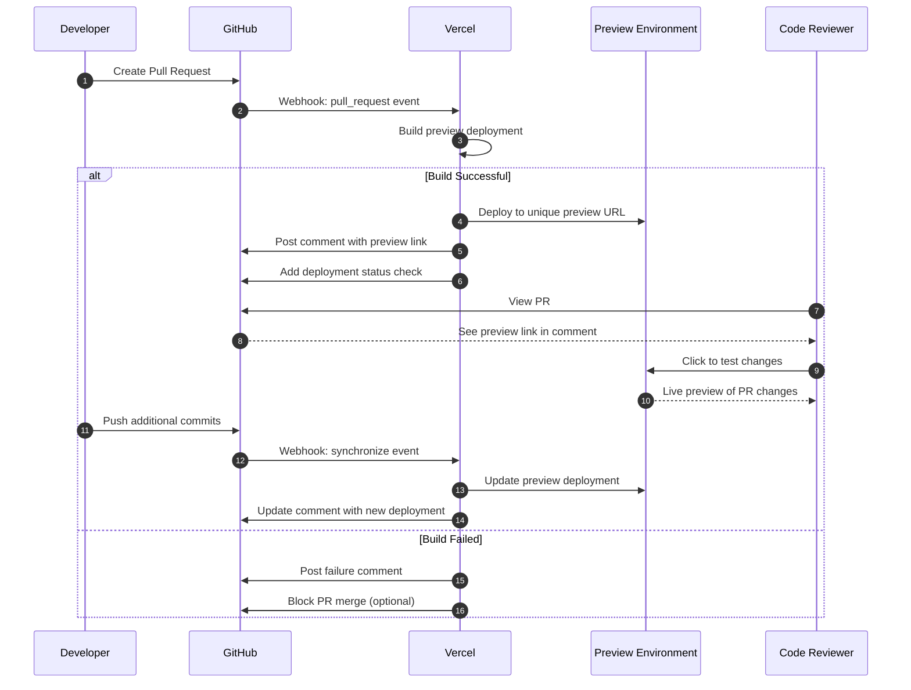
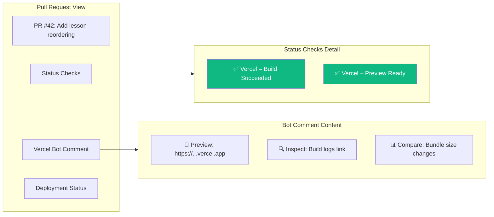
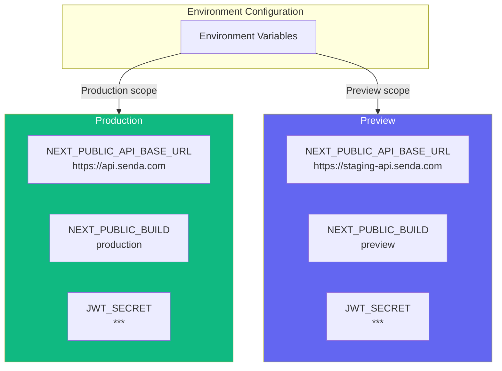
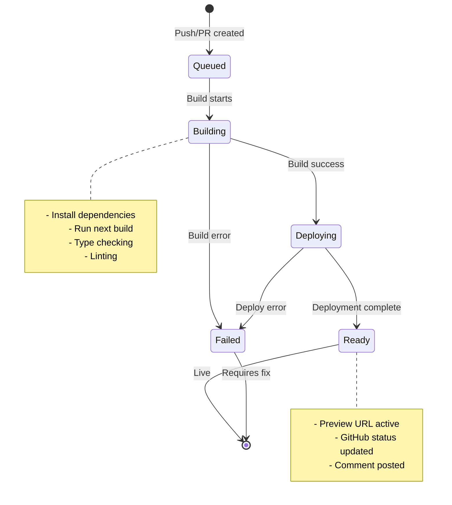

# Vercel Deployment Architecture

This document describes the deployment architecture for Senda CMS on Vercel, including the automatic deployment workflows, GitHub integration, and preview environments.

## Deployment Architecture Overview

Senda CMS uses Vercel as its hosting platform, leveraging its seamless integration with GitHub for continuous deployment. The architecture follows a **Git-based deployment model** where code changes automatically trigger deployments.



### Key Components

| Component                  | Description                                                                |
| -------------------------- | -------------------------------------------------------------------------- |
| **GitHub Repository**      | Source of truth for all code. Triggers deployments on push/PR events.      |
| **Vercel Build System**    | Automatically detects Next.js, runs `next build`, and deploys the output.  |
| **Production Environment** | Live application deployed from `main` branch. Connected to Production API. |
| **Preview Environments**   | Temporary deployments for each Pull Request. Connected to Staging API.     |
| **Senda API (Production)** | Production backend API hosted on Google Cloud Run.                         |
| **Senda API (Staging)**    | Staging backend API for testing preview deployments.                       |
| **AWS S3**                 | Media storage for course images and audio files.                           |

## Automatic Deployment Flow

### Production Deployment

When code is merged to the `main` branch, Vercel automatically builds and deploys to the production environment.



### Production Deployment Details

| Step           | Action         | Details                                             |
| -------------- | -------------- | --------------------------------------------------- |
| **1. Trigger** | Push to `main` | Any merge or direct push triggers deployment        |
| **2. Clone**   | Fetch code     | Vercel clones the repository at the specific commit |
| **3. Install** | Dependencies   | Runs `bun install` (auto-detected from lockfile)    |
| **4. Build**   | Next.js build  | Executes `next build --turbopack`                   |
| **5. Deploy**  | Publish        | Deploys to production domain                        |
| **6. Status**  | GitHub check   | Updates commit status with deployment URL           |

## Preview Deployments

Preview deployments are the cornerstone of Vercel's collaborative workflow. Every Pull Request automatically receives its own deployment with a unique URL.

### Preview Deployment Flow



### Preview URL Structure

Preview deployments receive automatically generated URLs following this pattern:

```
https://<project>-<unique-hash>-<team>.vercel.app
```

**Example:**

```
https://senda-cms-abc123def-fariassdev.vercel.app
```

### GitHub Integration

Vercel automatically adds deployment information to Pull Requests:



**What appears in the PR:**

1. **Status Checks**: Shows build status (success/failure)
2. **Deployment Comment**: Bot comment with:
   - Preview URL (clickable link to test the changes)
   - Inspect link (access to build logs)
   - Performance metrics (optional)
3. **Deployment Indicator**: GitHub's native deployment UI

## Environment Configuration

### Environment Variables by Deployment Type

Vercel allows configuring different environment variables for each deployment type:



### Variable Reference

| Variable                   | Production         | Preview                | Description            |
| -------------------------- | ------------------ | ---------------------- | ---------------------- |
| `NEXT_PUBLIC_API_BASE_URL` | Production API URL | Staging API URL        | Backend API endpoint   |
| `NEXT_PUBLIC_BUILD`        | `production`       | `preview`              | Environment identifier |
| `JWT_SECRET`               | Production secret  | Same or staging secret | JWT validation secret  |

## Branch Protection and Deployment Rules

### Recommended Branch Strategy

```mermaid
gitgraph
    commit id: "Initial"
    branch develop
    checkout develop
    commit id: "Feature work"
    branch "feature/lesson-audio"
    checkout "feature/lesson-audio"
    commit id: "Add audio"
    commit id: "Fix controls"
    checkout develop
    merge "feature/lesson-audio" tag: "Preview"
    checkout main
    merge develop tag: "v0.2.0"
    checkout develop
    branch "feature/export"
    commit id: "Export"
    checkout develop
    merge "feature/export" tag: "Preview"
```

### Deployment Rules

| Branch Pattern | Deployment Type | Environment | Auto-Deploy     |
| -------------- | --------------- | ----------- | --------------- |
| `main`         | Production      | Production  | ✅ Yes          |
| `develop`      | Preview         | Preview     | ✅ Yes          |
| `feature/*`    | Preview         | Preview     | ✅ Yes (via PR) |
| `hotfix/*`     | Preview         | Preview     | ✅ Yes (via PR) |

## Monitoring and Observability

### Deployment Status Flow



### Accessing Deployment Information

| Information               | Where to Find                                       |
| ------------------------- | --------------------------------------------------- |
| **Build Logs**            | Vercel Dashboard → Deployments → Select deployment  |
| **Preview URL**           | GitHub PR comment or Vercel Dashboard               |
| **Production URL**        | Vercel Dashboard → Domains                          |
| **Environment Variables** | Vercel Dashboard → Settings → Environment Variables |
| **Deployment History**    | Vercel Dashboard → Deployments                      |

## Quick Reference

### Common Scenarios

| Scenario                | Action                               | Result                               |
| ----------------------- | ------------------------------------ | ------------------------------------ |
| New feature development | Create PR from feature branch        | Preview deployment created           |
| Code review             | Click preview link in PR             | Test changes in isolated environment |
| Bug fix                 | Push commit to PR                    | Preview auto-updates                 |
| Release to production   | Merge PR to main                     | Production deployment                |
| Rollback                | Vercel Dashboard → Redeploy previous | Instant rollback                     |

### Useful Commands

```bash
# Test production build locally
bun run build
bun start

# Type check before pushing
bun typecheck

# Lint code
bun lint
```

---

**Last Updated:** 2025-12-20
**Author:** Technical Documentation
